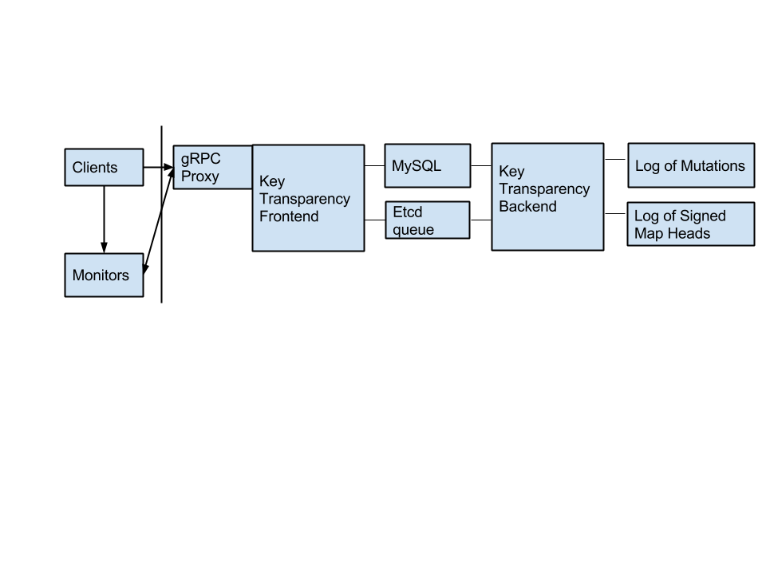

# Key Transparency Design Doc


## [Overview](overview.md)

Products that offer End to End encryption need a seamless and secure way to
discover the public keys of recipients. Key Transparency is a key directory
that can be audited in a style inspired by
[CONIKS](https://coniks.cs.princeton.edu) and
[Certificate Transparency](https://certificate-transparency.org),
removing the need for users to perform manual key verification.

## Security Model

Key Transparency provides methods for auditing both current and past values
that the server returned for an account. This audit ability is composed of the
following cryptographically verifiable primitives:

*   Everyone is querying the same data structure, as verified by a gossip
    protocol.
*   Each user has a single entry in the data structure, as verified by a unique
    index.
*   As user data changes and therefore the whole data structure, each change is
    stored in an append-only data structure.

Together these properties mean that even a malicious server cannot insert /
remove / tamper with a user’s keys without leaving a permanent trail of
evidence that can be automatically discovered.

### Threat Model

Capabilities of adversaries and the performance of Key Transparency under
adversarial conditions.

#### 1. Account Compromise

If an attacker gained access to a user’s account credentials, the attacker
could perform an account reset in order to change the user’s end-to-end keys.
This change would show up as a new key on all of user’s apps that are clients
of Key Transparency. After regaining control over their account, the user
could perform a second account-reset in order to reset the account to its
previous state.

#### 2. Client Compromise

Adversaries could modify Key Transparency clients to forgo performing the
proper account verification steps and hide a man-in-the-middle attack from
users. To detect this, a user just needs a clean verification client which may
be available on another device, compiled from source on github.com, or
navigated to on a 3rd party verification website.

If an attacker can modify a client with a private key, a man-in-the-middle
attack is unnecessary, as the adversary can exfiltrate decrypted plaintext. In
the future [Binary Transparency](https://groups.google.com/forum/#!forum/binary-transparency)
will help make modifications to client downloads and updates harder to hide.
Platform hardening is also needed to make local exploitation difficult.

In all cases of client compromise, a device reset and key rotation is needed to
restore the integrity of communication.

#### 3. Network Segmentation

The gossip protocol ensures that everyone is seeing the same results. If an
adversary has control over the server and also full control over a client’s
network connectivity in perpetuity, the adversary could perform a split-view
attack, whereby the adversary returns unique results to a specific client while
hiding those results from others to facilitate a man-in-the-middle attack.

Because Key Transparency uses an append-only log, this attack is estimated to
be expensive since the adversary must maintain the network segmentation as long
as the attack is to go undetected. Once detected, the split is globally visible
and implicates the whole server in the attack.

#### 4. Computational power

Key Transparency uses P-256 signatures and SHA512_256 hashes. If an adversary is
able to computationally break the cryptographic primitives Key Transparency
relies on, the adversary may also have the ability to extract private keys,
which is a more powerful attack.

#### 5. Denying Key Updates

A Key Transparency server could update user keys in a transparent, user visible
fashion that is analogous to an account-reset. The server could then
subsequently then deny the user the ability to remove or update unwanted public
keys under their account. This is permitted under this threat model.  The
presence of 3rd party account access is visible to the user and all public keys
are in the public record.

#### 6. Data Loss

Key Transparency will implement a robust data reliability strategy, as
implemented by the Certificate Transparency team. If catastrophic error were
to occur with data loss, the server would not be able to compute the signed
tree root. The key server would need to be declared corrupt, and a new
instance of the key server started.

## Architecture




## Privacy

Key Transparency will maintain a current and historical mapping between email
addresses and keys, along with what apps keys are for. This mapping, however, is
protected by cryptographic primitives which reduce the public map to a map of
opaque keys to opaque values. An observer of this map can only see an upper
bound on how many entries (users) there are in the map, and how quickly the map
is changing and growing (new users / user activity).

Given an email address, Key Transparency returns the set of public keys
associated with the user. Since public keys are associated with the apps they
are for, senders may be able to learn what End to End encrypted apps the
recipient has installed.

## API Reference

*   [Proto Definitions](../core/api/v1/keytransparency.proto)
*   [gRPC API](api.md)

## Multiple Apps and Keys

Key Transparency is designed to be a key directory service for multiple apps
using a variety of key formats at the same time. Individual apps may specify
their own key formats and the relationships between keys and devices.

## Construction

### Everyone sees the same results

Keys that a recipient sees for him/herself are the same keys a potential
sender sees. This property is accomplished by:

- Hashing all the keys that the server has, signing that hash, and publishing
  the Signed Map Head (SMH)

- Gossiping the SMH between key servers, monitors, and optionally between
  users.

"This is the hash I saw when I talked to the server, what did you see?" If the
server shows different results to different people, it will come to light as
soon as those people can communicate with each other or as soon as a user
queries other key servers.


### Your key is inside the common hash

Now that there's a SMH, or a summary, of the server's state that everyone
agrees on, we need a way to prove that any particular answer is contained in
that hash.

We do that by using something called a Merkle Tree. We take all the keys and
line them up on the bottom row. Then we take each pair of keys and hash them
together to form a second row with exactly half as many entries as the bottom
row. The process is repeated with the second row and third until there's only
one value at the top. We call this the SMH, and we use it for the hash we
previously talked about.


```
           o
      /         \
     o           o
   /   \       /   \
  o     o     o     o
 / \   / \   / \   / \
o   o o   o o   o o   o
```

To prove that a specific key is part of the root hash, verifiers should be able
to calculate the same root hash. This can be achieved given the key (k)
(located at a leaf node) and all neighboring nodes (n) up the tree all the way
to the root. Verifiers can then calculate the path from (k) to the root
(the nodes marked with (x) in the following tree). If the calculated root value
matches the gossiped one, then (k) is part of the root hash.


```
           x
      /         \
     n           x
   /   \       /   \
  o     o     x     n
 / \   / \   / \   / \
o   o o   o n   k o   o
```


### There is only one list of keys for you

Now that we can prove that there's only one state of the key server and we can
prove that your key is inside that state, we need to prove that there's only
one key for you in the whole server. Otherwise, a malicious key server could
store multiple keys for you and selectively show them to different people.

To prove that a single user (Alice) has exactly one profile, the server hashes
her user ID (typically an email address, e.g. alice@gmail.com) to produce
a string of bits. For instance,
`H(alice@gmail.com) = 010` (this is actually done using a VRF function described
below). If we think of the Merkle Tree as a binary search tree, with each bit
in the hash indicating a "left" or a "right" child, the tree depth is the
same as the hash output length, we then have a unique location in the tree for
Alice's profile. No more surreptitious shadow keys.

### Only your friends can look up your information

Traditional PGP key servers allow everyone to get a list of all the users who
are interested in secure email. This seems unnecessary and invites abuse. To
prevent this, we make sure that you can only look up a user’s information if
you already know their email address. User’s locations in the Merkle Tree will
be calculated with a Verifiable Random Function (VRF), conceptually equal to
`H(Sig(k, user_id))`. This forces attackers to perform an online query
to the server to learn a user’s location in the tree. The deterministic
signature proves that there is only one correct location in the tree for the
user.

### Single, authoritative history

### Client Operations

*   `Update key (user_id, public_key_material)`
*   `Get keys (user_id, revision_num, app_label_filter)`
*   `Get key history (user_id, revision_num, app_label_filter)`
*   `Invoke account reset (user_id)`

### Server Operations

*   Advance revision.

	Takes all the promises made since the previous revision and incorporates
	them into an updated Merkle Tree. This operation must occur at least every X
	minutes, but may occur as often as desired.

### Data Reliability & Availability

History must be kept for a long period of time . Clients will query historical
values for a user for the period of time since they last communicated with a
recipient.  The longer the history, the stronger a signal on “how long has this
key been around for” can be.

### [Verification by Key Owners](verification.md)

The only person that really knows if a key belongs to them is the user
themselves. User clients will query the server for their own values regularly,
looking for unknown keys. All the user’s clients should be notified when new
keys are detected. New keys may or may not actually belong to the user.

When a user comes online, the user must query their own identity for each revision
since last doing so. This verifies that the current set of keys belongs to the
user, and that the user’s identity was not compromised in between the present
moment and the last check.

Verification consists of checking that no unexpected changes have been made.
The current set of keys should match their local list of keys. Any changes
should alert the user.

Unauthorized changes may go undetected until the next time the user checks. If
the user knows ahead of time, the user could publish that their key should not
change for a period of time. But this requires the user to know ahead of time
when they will be offline.

### Data Publically Visible in the Sparse Merkle Tree

Commitment to an opaque blob.

### Public Monitors

Monitors verify that the Key Transparency server has not signed two different
versions of the sparse tree head for the same revision.  They also verify any
public properties of leaf nodes such as signatures and ordering.

### Gossip Model

The gossip model, like Certificate Transparency, has not been fully designed.
There is an [ongoing IETF
discussion](https://tools.ietf.org/html/draft-linus-trans-gossip-ct-00). A few
options being considered are:


1.  Minimal Gossip where SMH are put in a verifiable map indexed by map/revision.
1.  Servers and Monitors gossip current CT STH’s to each other.
1.  Clients randomly query multiple monitors as described in the CONIKS paper.

### Merge Delays

Key updates submitted to the server will not be visible until the next Signed
Map Head is published. This represents a tradeoff between update speeds and the
number of SMHs created. SMHs will be stored in a CT append-only log which is
logarithmic in efficiency.

## What Happens When...

#### A user loses all their keys?

The user performs an account reset

#### A user sees a key he or she doesn’t recognize on his / her account?

If the user still has an authorized device to update the account with, just
update the account. Otherwise, perform an account reset.

#### The server doesn’t add or revoke a key for the user?

The server can 404 the user, in which case, the user may phone a
journalist with an HTTPS transcript of the request.

#### Equivocates (Answers the same query in different ways for different users)

The equivocation will be immediately obvious through the gossip protocol.
Clients will either keep using old key values until one hash chain gets longer
than the other.  Clients should also report the equivocation to a monitoring
system.

#### How can a server be revoked?

TBD pending [Key Transparency Discovery](https://github.com/google/keytransparency/issues/389)

## References

1. [Revocation Transparency](http://sump2.links.org/files/RevocationTransparency.pdf)
1. [CONIKS](http://eprint.iacr.org/2014/1004)
1. [PGP implementer's workshop talk](http://wiki.gnupg.org/OpenPGPEmailSummit201512?action=AttachFile&do=view&target=key_transparency.pdf)
