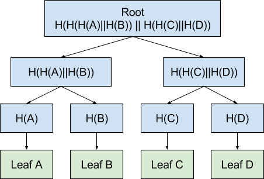
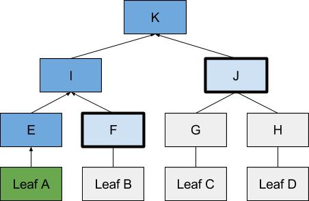
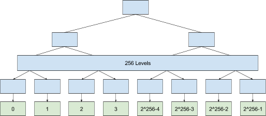
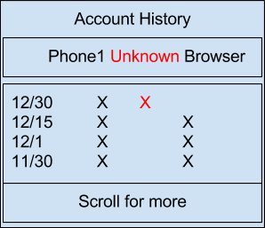

# Key Transparency Overview

## Introduction

Secure systems rely on an accurate understanding of who or what information is
being sent to or who may be permitted access. When you visit
https://myaccount.google.com it’s important that you’re visiting the real
Google. When you send a message, it’s important that it’s getting to the right
person. When you access your bank account, it’s important that it’s actually
you.

Today’s secure systems are constantly relying on other systems to answer
questions of “where should I send this” or “what’s the latest data in this
account”, yet those systems are not actually required to give correct answers,
and there’s no audit record of the answers they have given.

Key Transparency dramatically improves the situation by providing a public
audit record for all changes to data. When used with account data, Key
Transparency provides a public audit record of all the actual recipients (in
the form of public keys) associated with an account, all the times an
account was updated, and who it was updated by - all in a privacy preserving
way.

### Security Properties

#### Consistent results

Two users, querying for the public keys associated with the same account at the
same time will receive the same result. This allows receivers to verify their
account and have confidence that senders will be operating on the same
information. This shows that no third party has gained access to the
conversation by impersonating one of the communicating parties.

To accomplish this, the full database of accounts and their public keys are
hashed together, using a Merkle Tree, and the resulting hash is shared
(gossiped) between users themselves. The tree hash is constructed to be
efficient and support proving that a piece of data is contained in the hash.
User apps use this hash to verify that the results are part of the same hash.

<i>
Root Merkle Tree Hash efficiently hashes whole database
</i>

<i>
Merkle Tree Hash is used to prove that Leaf A is part of the root hash K by
hashing Leaf A, and then combining the resulting hash E with intermediate
nodes F and J to compute K.  If the computed K is equal to the known-good K,
the proof is correct and Leaf A is part of K.  If the computed K is not equal
to the known-good K, a data corruption warning must be displayed.
</i>

To show that there is a single entry in the Merkle Tree for each user we number
the leaf nodes from 0 to 2^256-1, and designate a single leaf node for each
user by the pseudo-hash of their email address. See below for a discussion of
the privacy preserving properties of the privacy preserving hash-like function
 that is used.

If the location provided does not match the pseudo-hash of the email address,
a wrong-user warning must be displayed.

<i>
Merkle Tree with 256 levels to accommodate 2^256-1 leaf
nodes.
</i>

#### Accurate Account History

When recipients audit their account they have confidence that senders will be
using their correct public keys if they were to send something *right now*.  
To give confidence that the user’s account remains secure through time,
Key Transparency provides an auditable account history.

To detect spurious keys, users might label the keys that they recognize with
the device that the private keys are on.  Their client software could then
alert them to new/unknown devices.

<i>
Example of how users might view their history to detect any unauthorized keys
in the past.  The red Unknown label indicates an unlabeled key, which may be
either malicious, or a new device.
</i>

To update accounts, the server collects all the changes requested every few
seconds, bundles them up, and creates a new snapshot of the database along with
a new Merkle Tree root. All previous snapshots and roots are available for
inspection at any time by the account holder.

To ensure that previous snapshots are not misrepresented, the Merkle Tree roots
of each snapshot are stored in another Merkle Tree that is also gossiped.

<i>
Merkle Tree with the roots of each snapshot.
This is the same Merkle Tree structure as is used in Certificate Transparency.
</i>

Because this Merkle Tree is filled in from left to right, there exists a proof
between any two states of the tree showing that each new state is an
append-only version of a previous state.

<i>
And append-only proof in bold, showing that the new state of the tree is equal
to the old tree plus snapshots 4-6.
</i>

#### Privacy

Public keys often contain personal information such as email addresses that
would be harmful to publish all at once for spam reasons. Rather than
publishing all the raw public keys, Key Transparency publishes cryptographic
commitments to those keys and then reveals them when keys for individual
accounts are requested.  This is analogous to putting each key in a
sealed envelope, and then only opening each envelope one at a time.

The location of an account in the Merkle Tree may also leak a user’s email
address. To prevent this, Key Transparency uses a Verifiable Random Function
(VRF) to determine the location of a user in the tree, and provides
proof-of-correctness when an individual account is requested.

Both techniques preserve the auditability of the whole data structure without
inordinately leaking the whole set of user identifiers. With knowledge of an
email address, individual accounts and their specific contents can be further
verified.

## Further Information

*   [Design Doc](design.md)
*   [Verification Algorithm](verification.md)
